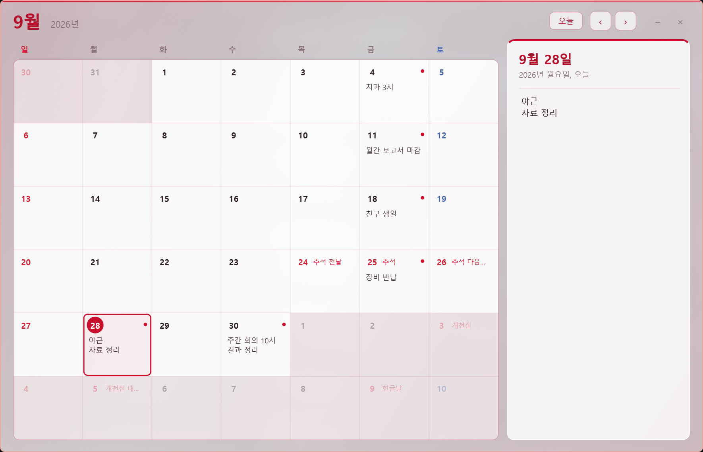
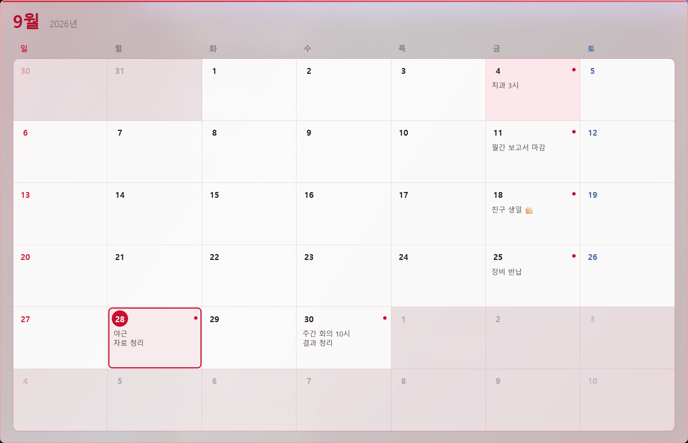

# Reimu Calendar (달력 메모)

날짜를 누르고 그날 있는 일을 직접 적어두는 간단한 Windows용 달력 앱입니다.
계정 연동이나 알림 없이, 달력 모양의 창에 메모만 남기는 용도로 만들었습니다.



다른 창을 쓰는 동안에는 버튼과 메모 칸이 숨고 달력만 남습니다.



## 만든 이유

달력에 그날 할 일 좀 적어 두려고 달력 앱을 받았더니, 쓸 만한 기능마다 돈을 내라고 했습니다.
날짜 누르고 글 몇 줄 적는 데 결제까지 해야 하나 싶어서 화가 났고, 그래서 그냥 직접 만들었습니다.

그래서 이 앱은

- **무료**입니다. 결제, 광고, 체험 기간 같은 건 없습니다.
- **계정이 필요 없습니다.** 가입이나 로그인 없이 exe 하나면 됩니다.
- **소스가 공개되어 있습니다** ([MIT](LICENSE)). 마음에 안 드는 부분은 고쳐 써도 됩니다.

## 다운로드

[Releases](../../releases/latest)에서 `reimu-calendar.exe`를 받아 실행하면 됩니다. Python을 따로 설치할 필요가 없습니다.

- Windows 10/11 64비트용입니다. 창 뒤 흐림과 둥근 모서리는 Windows 11에서 가장 잘 보입니다.
- 서명되지 않은 exe라서 처음 실행할 때 "Windows의 PC 보호" 창이 뜰 수 있습니다. **추가 정보 → 실행**을 누르면 됩니다.

## 기능

- 월 단위 달력에서 날짜를 누르면 오른쪽 칸에 그날의 메모를 적을 수 있습니다.
- 적은 내용은 달력 칸에도 미리보기로 표시됩니다.
- 입력을 멈추고 0.6초가 지나면 자동으로 저장됩니다.
- 메모를 모두 지우면 그 날짜의 기록도 삭제됩니다.
- 창 크기와 메모 칸 너비는 다음 실행 때도 그대로 유지됩니다.
- 기본 창 틀 대신 붉은색·흰색 유리창 모양의 창으로 뜹니다. 창 뒤 배경은 흐리게 비칩니다.
- 창에 마우스를 올리지 않고 다른 창을 쓰는 동안에는 버튼과 메모 칸이 숨고 달력만 보입니다.
- 창 이동은 윗부분(월 제목 쪽)을 끌고, 크기 조절은 창 가장자리를 끕니다. 윗부분을 더블클릭하면 최대화됩니다.
- 한국 공휴일(설·추석 연휴, 대체공휴일, 선거일 포함)을 빨간 날로 표시하고 이름을 보여줍니다. 인터넷 연결 없이 계산합니다.
- 닫기(×)를 누르면 작업표시줄 오른쪽의 트레이로 숨습니다. 트레이 아이콘을 누르면 다시 열리고, 완전히 끄려면 트레이 아이콘이나 창을 우클릭해서 **종료**를 누릅니다.
- 이미 실행 중일 때 exe를 다시 실행하면 새 창을 띄우지 않고 기존 창을 불러옵니다.
- 처음 실행하면 사용법 안내가 뜹니다. 나중에 다시 보려면 `F1`을 누르거나 우클릭 → **사용법**을 누릅니다.

### 빠른 메모 (전역 단축키)

어떤 프로그램을 쓰고 있든 `Ctrl + Alt + Space`를 누르면 달력이 앞으로 나오고 오늘 메모에 커서가 갑니다.
적고 `Esc`를 누르면 저장되고, 하던 창으로 돌아갑니다. 트레이에 숨어 있었다면 다시 숨습니다.

다른 프로그램이 이미 `Ctrl + Alt + Space`를 쓰고 있으면 비어 있는 다른 키(`Ctrl + Alt + Enter` 등)를 자동으로 씁니다.
지금 어떤 키인지는 `F1` 안내나 트레이 메뉴에 나오고, 우클릭 → **빠른 메모 단축키**에서 바꿀 수 있습니다.

### 우클릭 메뉴

| 항목 | 설명 |
| --- | --- |
| 평소엔 달력만 보이기 | 다른 창을 쓰는 동안 버튼과 메모 칸을 숨깁니다. |
| 창 뒤 흐림 효과 | 창을 끌 때 버벅이는 PC라면 끄세요. |
| 창 위치 → 보통 / 항상 위 / 바탕화면에 고정 | **바탕화면에 고정**은 항상 다른 창들 뒤에 깔려 바탕화면 위젯처럼 보입니다. 트레이에서 열면 잠깐 앞으로 나왔다가, 다른 창을 쓰면 다시 뒤로 갑니다. |
| 빠른 메모 단축키 | 빠른 메모 키를 고릅니다. 다른 프로그램이 쓰고 있는 키는 "(사용 중)"으로 표시됩니다. |
| Windows 시작 시 자동 실행 | 컴퓨터를 켜면 자동으로 실행됩니다. 이때는 다른 창의 포커스를 뺏지 않고 달력만 보이는 상태로 뜹니다. |
| 사용법 | 사용법 안내를 엽니다. 안내 창의 **추천 설정 켜기**를 누르면 바탕화면 고정과 자동 실행이 한 번에 켜집니다. |
| 종료 | 앱을 완전히 끕니다. |

바탕화면에 고정해도 진짜 바탕화면 아이콘과는 다른 일반 창이라서, `Win + D`(바탕화면 보기)를 누르면 다른 창들과 같이 가려질 수 있습니다.

## 단축키

| 동작 | 키 |
| --- | --- |
| (어디서든) 오늘 메모 바로 쓰기 | `Ctrl + Alt + Space` → 다 쓰면 `Esc` |
| 이전 달 / 다음 달 | `Alt + ←` / `Alt + →` 또는 마우스 휠 |
| 오늘로 이동 | `Ctrl + T` |
| 즉시 저장 | `Ctrl + S` |
| 날짜 선택 후 바로 입력 | 날짜 더블클릭 |
| 사용법 안내 | `F1` |

## 실행하기

Python 3.10 이상이 필요합니다.

```
pip install -r requirements.txt
python calendar_notes.pyw
```

확장자가 `.pyw`라서 파일을 더블클릭하면 콘솔 창 없이 실행됩니다.

## exe로 빌드하기

```
pip install -r requirements.txt pyinstaller
python build.py
```

빌드가 끝나면 `dist\reimu-calendar.exe`가 생깁니다. 이 파일 하나만 있으면 Python 없이 실행됩니다.
`build.py`는 아이콘과 exe 파일 속성(제품 이름, 버전)까지 넣어서 빌드합니다. 버전은 `calendar_notes.pyw`의 `__version__`을 따릅니다.

### 새 버전 배포하기 (관리자용)

1. `calendar_notes.pyw`의 `__version__`을 올립니다. 예: `"1.0.2"`
2. 커밋하고, 같은 번호로 태그를 올립니다.
   ```
   git tag v1.0.2
   git push origin main v1.0.2
   ```
3. GitHub Actions가 exe를 빌드합니다. SignPath가 설정되어 있으면 서명한 뒤 Releases에 올립니다. 태그와 `__version__`이 다르면 빌드가 멈춥니다.

### 아이콘 바꾸기

`app.ico`는 `icon.png`의 달력 카드 부분을 둥근 모서리대로 잘라 만든 것입니다. `icon.png`를 바꾼 뒤 다시 만들려면:

```
python make_icon.py        # app.ico 생성 + icon_options\preview.png 에 크기별 미리보기
```

카드 위치는 `make_icon.py` 위쪽의 `CARD_*` 값으로 정합니다. 구도가 다른 그림을 쓸 때는 이 값을 맞춰 주세요.

Windows 탐색기는 아이콘을 캐시하므로, 바꾼 뒤에도 예전 아이콘이 보이면 exe 이름을 바꾸거나 다시 로그인하면 반영됩니다.

exe 하나로 묶은 빌드라서 실행할 때마다 임시 폴더에 압축을 풀고, 그래서 시작이 1~3초 정도 느립니다.

## 데이터와 로그 위치

| 항목 | 경로 |
| --- | --- |
| 메모 | `%APPDATA%\CalendarNotes\notes.json` |
| 로그 | `%APPDATA%\CalendarNotes\logs\calendar.log` |
| 창 위치·설정 | 레지스트리 `HKEY_CURRENT_USER\Software\CalendarNotes` |
| 자동 실행 (켰을 때만) | 레지스트리 `HKEY_CURRENT_USER\Software\Microsoft\Windows\CurrentVersion\Run` 의 `ReimuCalendar` 값 |

메모는 exe 옆이 아니라 위 경로에 저장되므로, exe를 옮기거나 새로 빌드해도 데이터는 그대로입니다. 다른 PC로 옮기려면 `notes.json`만 복사하면 됩니다.

메모 파일은 아래와 같은 일반 JSON입니다.

```json
{
  "version": 1,
  "notes": {
    "2026-09-28": "야근",
    "2026-09-30": "주간 회의 10시\nDF 검증 결과 정리"
  }
}
```

저장할 때는 임시 파일에 먼저 쓴 뒤 교체하는 방식이라, 저장 도중 전원이 꺼져도 기존 파일이 깨지지 않습니다.

## 오류 처리

- 저장이나 불러오기에 실패하면 원인이 로그 파일에 기록되고, 창 아래쪽에 로그 경로가 표시됩니다.
- 메모 파일이 손상되어 읽을 수 없으면 `notes.corrupt-날짜.json`으로 따로 보관한 뒤 새로 시작하고, 그 사실을 알려줍니다.
- 권한 문제 등으로 파일을 읽지 못하면 기존 데이터를 덮어쓰지 않도록 저장을 막고 로그에 원인을 남깁니다.
- 처리되지 않은 예외와 Qt 경고도 모두 같은 로그 파일에 기록됩니다.
- 더 자세한 로그가 필요하면 환경변수 `CALENDAR_DEBUG=1`을 설정하고 실행합니다.

## 문제 해결

**exe를 실행해도 아무 반응 없이 꺼질 때**
먼저 `%APPDATA%\CalendarNotes\logs\calendar.log`를 확인합니다. 로그 파일이 아예 없다면 앱이 시작되기 전에 실패한 것입니다. `python calendar_notes.py`처럼 콘솔에서 실행해 보면 오류가 그대로 표시됩니다. 파일 이름을 `.py`로 복사해서 실행하면 됩니다.

**창이 안 보이는데 실행은 되어 있을 때**
트레이로 숨겨진 상태입니다. 작업표시줄 오른쪽 트레이(`^` 안쪽)에서 아이콘을 누르거나, exe를 한 번 더 실행하면 창이 나옵니다.

**exe를 다른 폴더로 옮겼을 때**
자동 실행이 켜져 있으면, 옮긴 exe를 한 번 실행할 때 등록된 경로도 새 위치로 바뀝니다.

## 삭제하기

설치 과정이 없는 앱이라, 아래 순서대로 지우면 흔적이 남지 않습니다.

1. 자동 실행을 켰다면 우클릭 → **Windows 시작 시 자동 실행**을 꺼 주세요.
2. 우클릭 → **종료**로 앱을 끕니다.
3. `reimu-calendar.exe` 파일
4. `%APPDATA%\CalendarNotes` 폴더 (메모와 로그)
5. 레지스트리 `HKEY_CURRENT_USER\Software\CalendarNotes` 키 (창 위치와 설정)

## Code Signing Policy

Free code signing provided by [SignPath.io](https://signpath.io), certificate by [SignPath Foundation](https://signpath.org).

Release binaries are built from this repository by [GitHub Actions](.github/workflows/release.yml) and signed only after manual approval.

| Role | Members |
| --- | --- |
| Committers and reviewers | [19GHYun](https://github.com/19GHYun) |
| Approvers | [19GHYun](https://github.com/19GHYun) |

### Privacy policy

This program will not transfer any information to other networked systems unless specifically requested by the user or the person installing or operating it.

이 프로그램은 네트워크 통신을 하지 않습니다. 메모와 설정은 모두 이 PC 안(위 "데이터와 로그 위치")에만 저장됩니다.

## License

소스 코드는 [MIT License](LICENSE)로 배포합니다.

아이콘 그림(`icon.png`, `app.ico`)은 동방 프로젝트의 캐릭터 하쿠레이 레이무를 그린 비상업 2차 창작 이미지입니다. 캐릭터에 대한 권리는 원작자(ZUN / 상하이 앨리스 환악단)에게 있으며, 이 그림에는 MIT License가 적용되지 않습니다.
